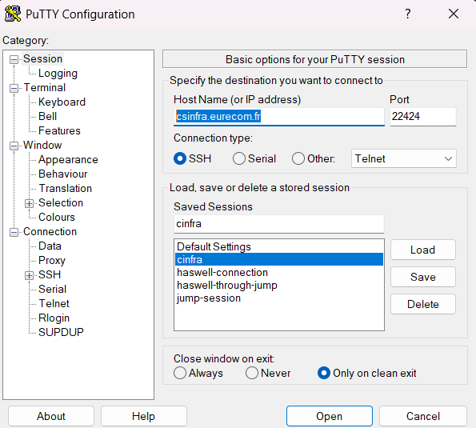
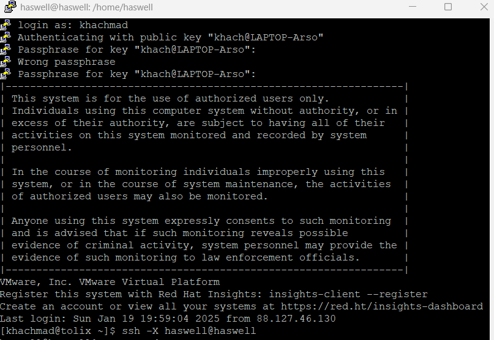

# **Automating the Process of OAI Log Conversion**

## **Project Overview**
This semester project focuses on automating the conversion of **qmdl/qmdl2 files to text files** using the QCAT application. This process, which is typically done manually through QCAT's graphical user interface, has been automated using the **PyAutoGUI** library. The automation reduces the repetitive nature of manual interaction, increasing efficiency and accuracy.

### **Steps in the Automation Process**
1. **Manual Conversion Process**:
   - Normally, users must click buttons and interact with QCAT to load `.qmdl` files and save them as `.txt` files.
   - This involves repetitive GUI interactions like opening files, saving outputs, and confirming overwrites.

2. **Automation**:
   - We captured screenshots of QCAT buttons (e.g., "Open", "Save to Text") and used PyAutoGUI to automate the interactions.
   - PyAutoGUI locates GUI elements based on the reference images and interacts with them programmatically.

---

## **Technical Details**

### **Libraries Used**
- **PyAutoGUI**: For GUI automation (locating, clicking, and interacting with UI elements).
- **Time**: To introduce delays between steps, ensuring GUI elements are ready for interaction.

---

## **Automation Process**

### **Steps to Automate QCAT Interactions**
1. **Locate and Interact with UI Elements**:
   - Screenshots of UI elements are saved as reference images (e.g., `open_button.png`).
   - PyAutoGUI searches for these elements on the screen, clicks them if found, or reports if they are missing.

2. **Detailed Automation Steps**:
   - **Step 1**: Locate and click the **"Open Option"** button to access file options.
   - **Step 2**: Locate and click the **"Open File"** option to select a `.qmdl` file.
   - **Step 3**: Locate and click the **"Open"** button to proceed.
   - **Step 4**: Locate and click the **"Save to Text"** button to begin the conversion process.
   - **Step 5**: Locate and click the **"Save"** button to save the output as a `.txt` file.
   - **Step 6 (Optional)**: If a file already exists, locate and click the **"Yes"** button to overwrite the file.

3. **Timing Delays**:
   - Delays are introduced between steps using the `time.sleep()` function to ensure GUI elements are fully loaded and ready for interaction.

---

## **Environment Setup**

### **Prerequisites**
1. **Python**: Install Python 3.6 or higher.
2. **PyAutoGUI**:
   ```bash
   pip install pyautogui
   ```
3. **Prepare Reference Images**:
   - Capture screenshots of QCAT buttons and save them as `.png` files in your project directory (e.g., `open_button.png`, `save_button.png`).

4. **Run QCAT**:
   - We can run it manually using this command: sudo /opt/qcom/QCAT7/bin/QCAT
   - We need XLaunch running in the background.

---

## **Commands and Workflow**

### **Step 1: Connect to Remote Machines**
1. **Connect to `cinfra` using PuTTY**:
   
   

2. **SSH to `haswell` from `cinfra`**:
   ```bash
   ssh -X haswell@haswell
   ```

---

### **Step 2: Run the Automation Script**
1. Navigate to the directory containing the automation script and images:
   ```bash
   cd /path/to/automation_project
   ```

2. Execute the Python automation script:
   ```bash
   python automate_qcat.py
   ```

---
The automation script is running in a local windows machine.
## **Sample Script: `automate_qcat.py`**
```python
import pyautogui
import time

def locate_and_click(image_path, confidence=0.8):
    location = pyautogui.locateCenterOnScreen(image_path, confidence=confidence)
    if location:
        pyautogui.click(location)
        print(f"Clicked on {image_path}")
    else:
        print(f"Object not found: {image_path}")

# Step-by-step automation
time.sleep(2)  # Initial delay to switch to QCAT window
locate_and_click("open_option.png")
time.sleep(1)
locate_and_click("open_file.png")
time.sleep(1)
locate_and_click("open_button.png")
time.sleep(1)
locate_and_click("save_to_text.png")
time.sleep(1)
locate_and_click("save_button.png")
time.sleep(1)
locate_and_click("yes_button.png")  # Optional for overwrites
```

---

## **Testing and Debugging**
1. **Check Screen Resolution**:
   - Ensure the screen resolution is consistent with the captured screenshots.
2. **Adjust Confidence Level**:
   - If PyAutoGUI cannot locate elements, adjust the `confidence` parameter (e.g., `confidence=0.7`).
3. **Verify Button Locations**:
   - Use screenshots to ensure all referenced elements are visually distinct and recognizable.

---

## **Future Improvements**
- **Error Handling**: Add retries for missing elements.
- **Dynamic File Paths**: Automatically detect `.qmdl` files in a directory and process them sequentially.
- **Cross-Platform Support**: Adapt the script to work on different operating systems.

---

## **Known Issues**
- The script may fail if:
  - The QCAT GUI layout changes.
  - Screen resolution differs from the reference images.
  - Delays between steps are insufficient.